🌏 [English](README.md) | 中文

# 响应式图片处理

在开发网络应用时，我们经常会把原始图片保存起来，然后生成各种尺寸的缩略图，以及对图片进行翻转、裁剪和旋转等简单的处理。这种使用场景非常常见，以至于主流的云平台都提供了 PaaS 服务，其基本原理是基于 CDN 服务增加图片处理的逻辑，通过不同参数配合实现不同的图片处理功能。比如 Azure 中国区域的 CDN 就提供了这样的功能——[Azure CDN 图片处理](https://docs.azure.cn/zh-cn/cdn/cdn-image-processing)。

遗憾的是 Azure 海外区域还没有这个托管服务，不过结合已有的托管服务，实现一套这样的图片处理方案非常方便，尤其是使用 [Azure App Service](https://azure.microsoft.com/products/app-service/) 作为核心的计算服务，不仅[支持各种主流开发语言](https://learn.microsoft.com/en-us/azure/app-service/overview#built-in-languages-and-frameworks)，还内置了常见的扩展，开发图片处理的小应用就更加轻松了。

此方案整体架构图非常简洁。


# 准备一个 Blob 存储容器

上传的原始图片保存在 Azure Blob 存储中，参考[官方文档创建一个 Blob 存储容器](https://learn.microsoft.com/azure/storage/blobs/storage-quickstart-blobs-portal#create-a-container)，这里不再赘述。把创建好的Blob 存储容器名称记录下来，保存为一个环境变量 `AZURE_BLOB_CONTAINER`。

然后向这个存储容器中[上传几个图片文件](https://learn.microsoft.com/azure/storage/blobs/storage-quickstart-blobs-portal#upload-a-block-blob)，比如我上传了一个名为 Microsoft.png 的图片文件，供后续开发演示用。

把 Blob 存储容器的连接字符串记录下来，在存储账户的 Security + networking 下找到 Access keys，主窗格里的 key1 下面的 Connection string 点击 Show 按钮，再点击复制图标，把连接字符串复制到剪贴板，然后保存为一个环境变量 `AZURE_BLOB_CONNECTION`。后续供图片处理的应用使用。


# 本地开发
此应用开始时使用的是 PHP 8.2.1，需要启用 GD 扩展用于图片处理。使用 PHP Composer 安装 microsoft/azure-storage-blob。

把当前源码库 clone 到本地后，
```shell
cd image-process
php -S localhost:8000
```
即可运行本地测试站点。
在浏览器中打开 `http://localhost:8000/?filename=Microsoft.png&width=100&height=100` 即可看到图片处理的效果。

# App Service 部署

参考官方文档创建一个 App Service 实例，海外 Azure 支持免费档，足够我们测试和演示使用了。创建好的 App Service 实例所在资源组和名称记录下来，启用一个本地 Shell 保存为2个常量方便后续使用命令行部署。

把前面保存的Blob存储容器的连接字符串和名称设置成 App Service的应用设置项目，可参考[官方文档](https://docs.microsoft.com/azure/app-service/configure-common#configure-app-settings)。

最后把代码打包部署上去即可。

```
RESOURCE_GROUP=my_resource_group
WEBAPP_NAME=my_app_service_name

az webapp config appsettings set -g $RESOURCE_GROUP -n $WEBAPP_NAME --settings AZURE_BLOB_CONNECTION="my_blob_connection"

az webapp config appsettings set -g $RESOURCE_GROUP -n $WEBAPP_NAME --settings AZURE_BLOB_CONTAINER="my_blob_container"

zip -r deploy.zip .
az webapp deploy -g $RESOURCE_GROUP -n $WEBAPP_NAME --src-path deploy.zip --type zip
```
App Servie PHP 8.2 版本直接支持 GD 库，无需安装。

到此，我们已经完成了一个简单的图片处理应用的开发和部署，可以在浏览器中访问 `https://my_app_service_name.azurewebsites.net/index.php?filename=Microsoft.png&width=100&height=100` 查看效果。更多图片处理的效果及参数，请参见[源码](index.php)。

接下来就是配置 CDN 服务，让图片处理应用能够通过 CDN 服务提供的功能，实现图片处理的加速。

# 配置 CDN 服务
先确认 CDN 服务已经注册为 resource provider。先到订阅的 Settings 找到 Resource provider，然后搜索 CDN，如果没有找到，点击 Register 按钮注册。


创建CDN实例，在 Offering 页点 Explore other offerings，再点 Azure CDN Standard from Microsoft (classic) 。

再按提示选择订阅、资源组，填写 CDN profile名称等即可。


CDN profile 创建好后，添加一个 Endpoint。在 CDN Profile 的 overview 页，右边主窗格点 +Endpoint 按钮，按提示填写 Endpoint 名称如`my_cdn_endpoint`、源站类型选择 `Web App`。

Origin hostname 从下拉菜单中选择前面部署好的 App Service 实例，比如 `my_app_service_name.azurewebsites.net`。其它的保持默认，点击最底下的 Add 按钮。


现在我们的图片处理都是通过参数来控制的，所以需要在 CDN Endpoint 的配置里把每个查询字符串的参数分别缓存。在 CDN Endpoint 的左侧导航菜单找到 Setting 下的 Caching Rules，右边主窗格点 Query string caching behavior菜单选择 Cache every unique URL，点击最上面的 Save 按钮。


配置 CDN 的 Rules engine，这里使用简单的图片缓存 1小时的规则。在 Setting 下点击 Rules Engine，在 Global 右边点击 + Add action，在下拉菜单中选择 Cache Expiration。

在 Cache behavior 菜单选择 Set if missing，然后 Days 填写 1，然后点击上面的 Save 按钮即可。

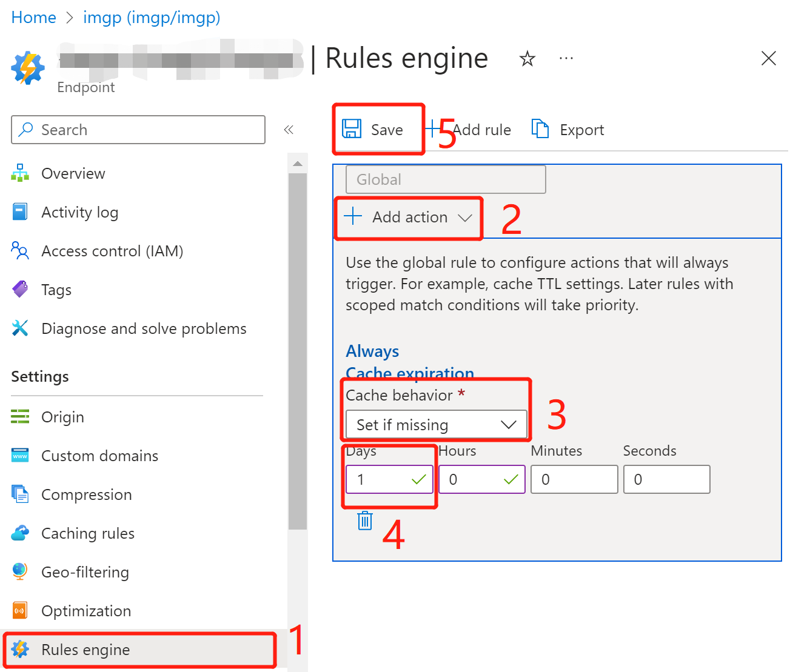

到此，CDN 服务已经配置好了，可以在浏览器中访问 `https://my_cdn_endpoint.azureedge.net/index.php?filename=Microsoft.png&width=100&height=100` 查看效果。

## 添加自定义域名

要添加自定义域名，首先要在 DNS 服务商那里添加一个 CNAME 记录，指向 CDN Endpoint 的自定义域名。比如我在 阿里云的域名解析控制台添加了一个 CNAME 记录，指向 `my_cdn_endpoint.azureedge.net`。

然后回到 Azure CDN Endpoint 的配置里，找到 Custom domains，点击 +Custom domain 按钮，按提示填写自定义域名，点击最底下的 Add 按钮。

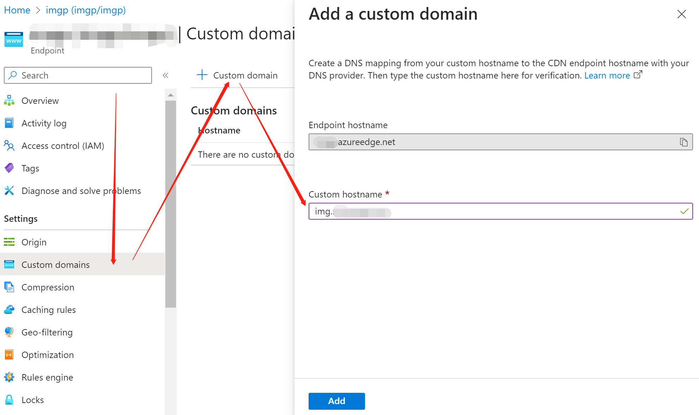

新添加上的自定义域名，其 Custom HTTPS 状态为 disabled。点击这条记录，进入 Custom domain HTTPS 管理页。
点击 On 按钮；
Certificate management type 选择 CDN managed；
Minimum TLS version 选择 TLS 1.2。
点击上面的 Save 按钮。默认情况下 Azure 会托管地为自定义域名申请一个证书，这个过程可能需要几分钟时间，请耐心等待下成的状态逐个变成完成。

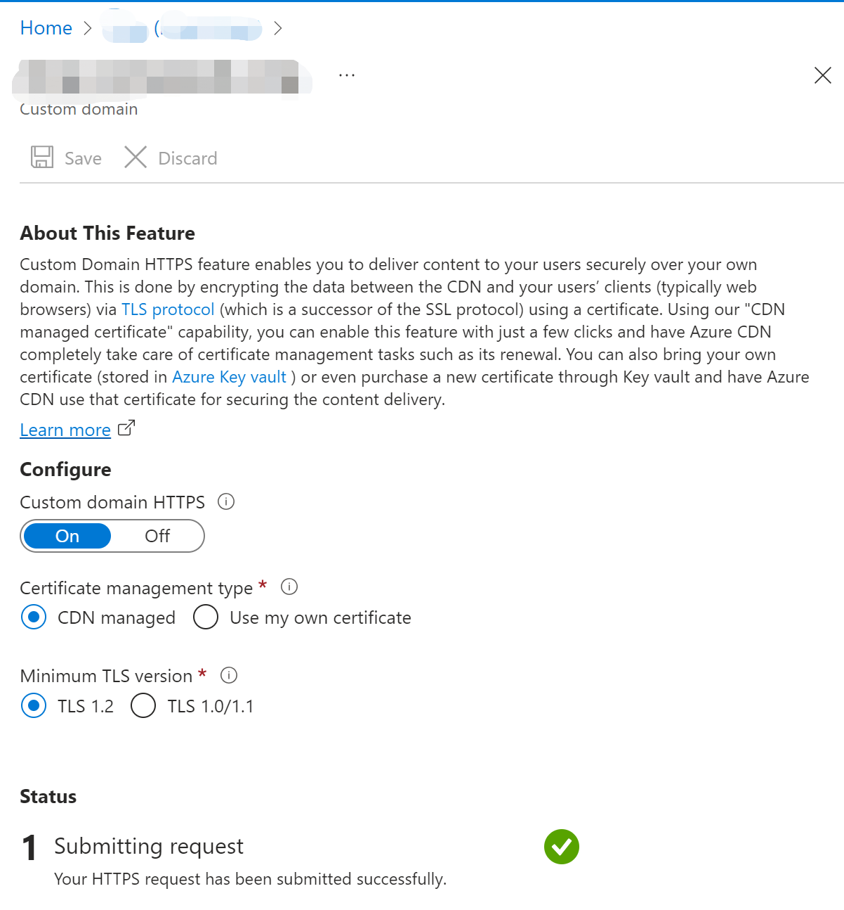

到此，我们的图片处理应用已经可以通过自定义域名访问了，比如我在浏览器中访问 `https://my_cdn_domain/index.php?filename=Microsoft.png&width=100&height=100` 查看效果。

# Azure 中国区域的CDN配置
Azure 中国区域和 Azure 海外区域的 CDN 服务有一些差异，主要是在证书管理上。Azure 中国区域的 CDN 服务不支持自定义域名的证书管理，只能通过 Azure Key Vault 管理证书。所以我们需要先在 Azure Key Vault 里创建一个证书，然后在 CDN Endpoint 的配置里选择现有证书。前述的 Blob Storage 和 App Service 的配置不变。整体架构图稍微复杂一点。

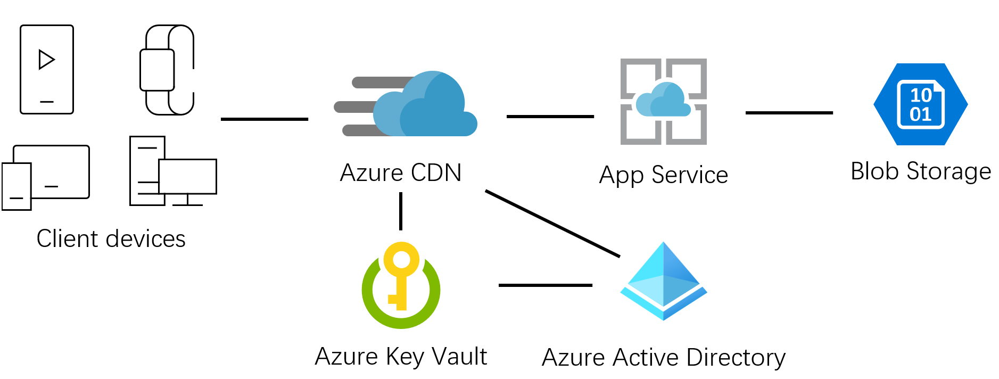

## 在 Microsoft Entra ID 中注册一个应用

在 Microsoft Entra ID 中左侧导航链接中 Manage 下点击 App registrations，然后点击 New registration 按钮，按提示填写应用名称比如“CDN HTTPS”。
Supported account types 选择 Accounts in this organizational directory only。
点击 Register 按钮。

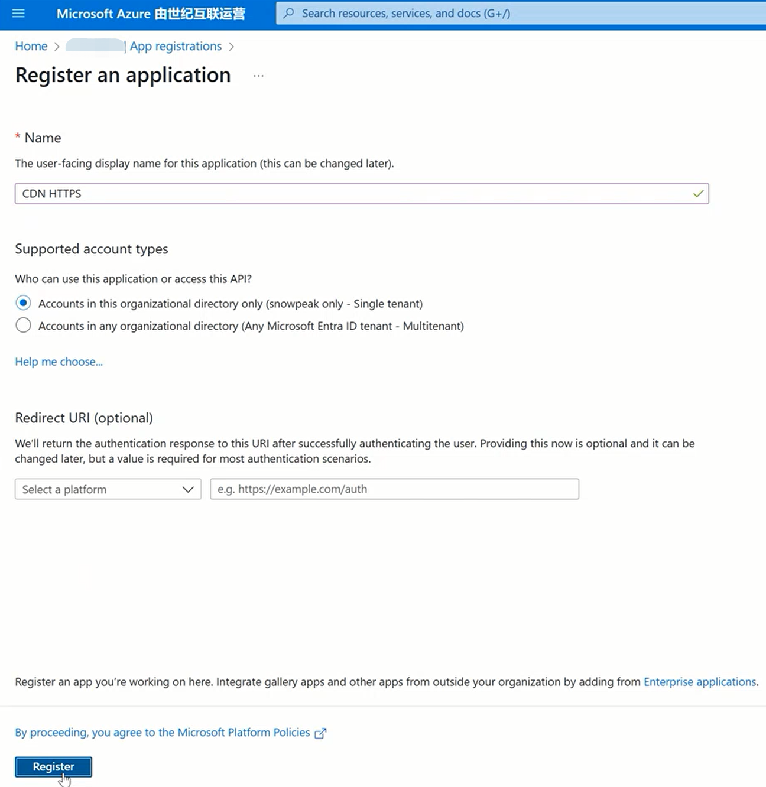

注册好的应用点击到 Overview 页，记录下 Application (client) ID。

然后点击左侧导航链接的 Certificates & secrets，点击 New client secret 按钮，按提示填写 Secret description，Expires 选择 730 days，点击 Add 按钮。

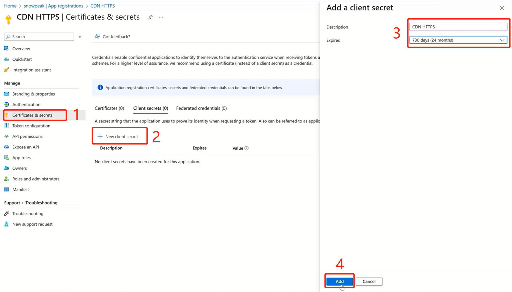
添加成功后，立刻在其 Value 处点击复制图标，把 Secret value 复制到剪贴板。注意这个 Secret value 只会显示一次，所以一定要立刻复制保存好。

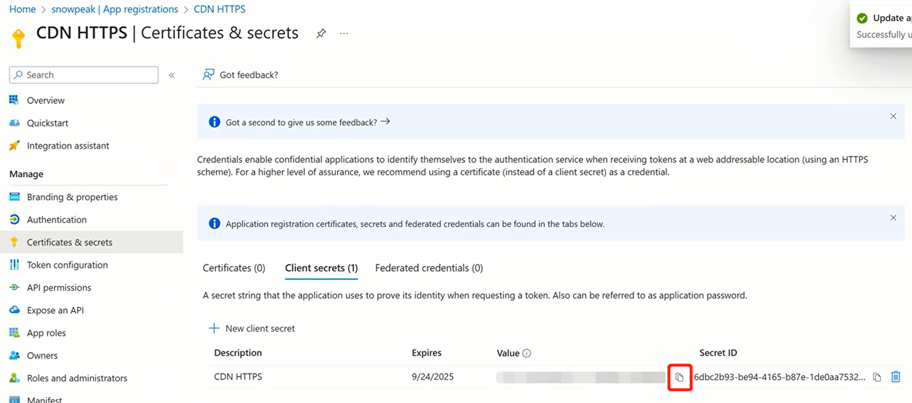

## 在 Azure Key Vault 里创建一个证书
参考官方文档[创建一个 Key Vault](https://docs.azure.cn/zh-cn/key-vault/general/quick-create-portal)，然后[上传一个用于 CDN 域名的证书官方文档](https://docs.microsoft.com/azure/key-vault/certificates/quick-create-portal#create-a-certificate)。

## 在 Key Vault 给 Entra 应用赋权

在 Key Vault 左侧导航链接点击 Access Policies，点击 + Create 按钮，在 Create an access policy 页把 Key Permissions、Secret Permissions、Certificate Permissions 都选中，然后点击 Next 按钮。

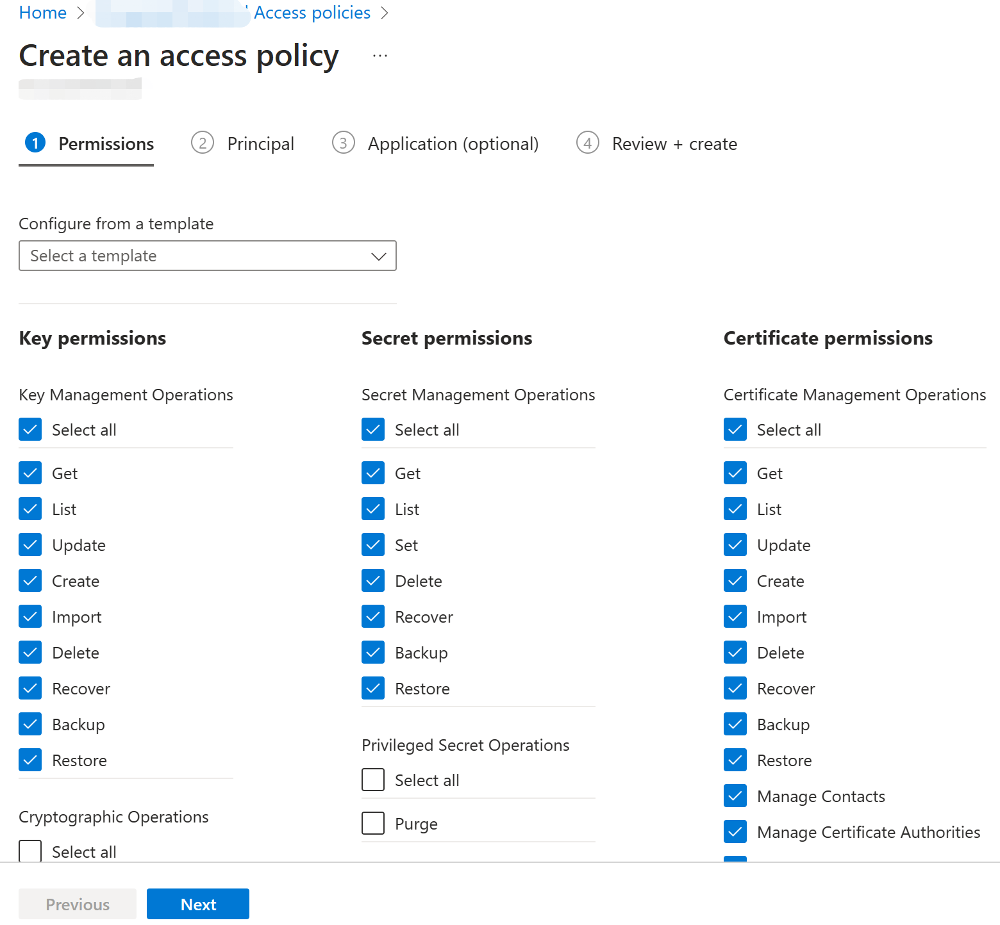

在 2 Principal 页点击 Select principal 按钮，然后在搜索框中输入应用名称，比如“CDN HTTPS”，然后点击搜索结果中的应用名称，点击 Select 按钮。然后点击 Next 按钮。

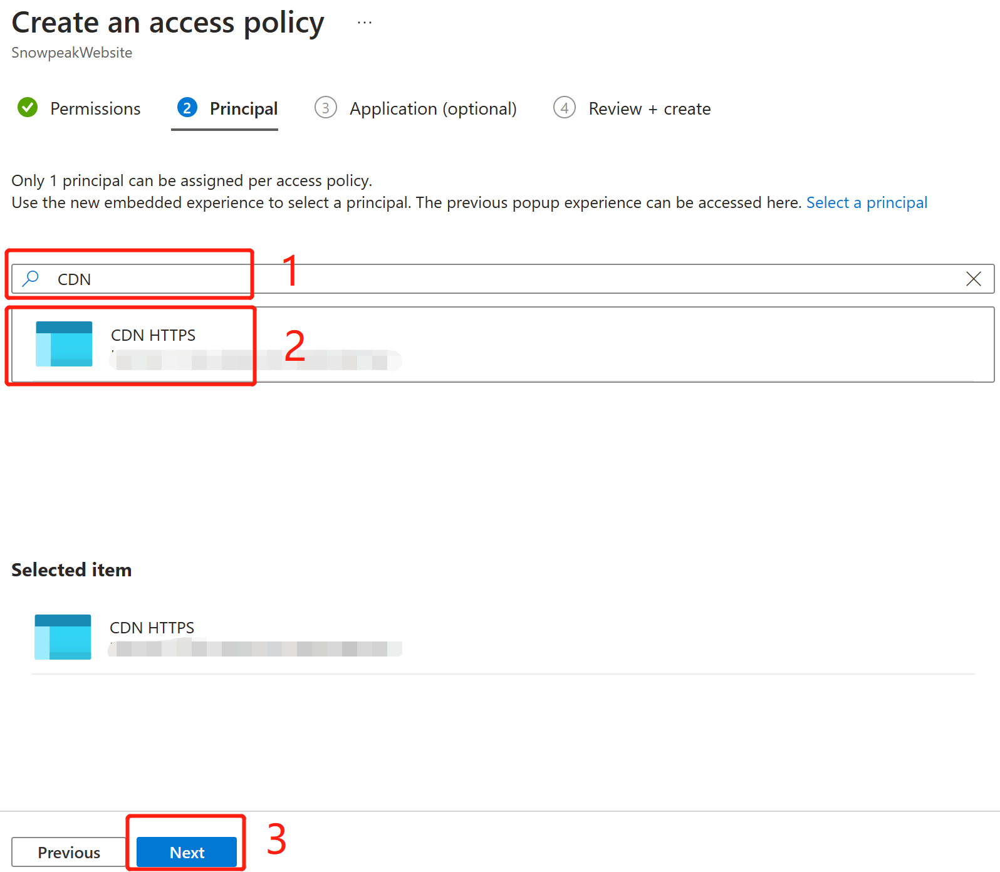

Application 页不用修改，直接点击 Review + create 按钮，然后点击 Create 按钮。

回到 Key Vault 的 Overview 页，记录下 Vault URI。

## 配置 CDN Profile
创建 CDN Profile 的操作和海外 Azure 相同，也需要先到自己的 DNS 解析处添加 CNAME 记录，把自定义域名指向 CDN Endpoint 的自定义域名。之后添加 Endpoint 的操作不相同。点击 + Endpoint 按钮，按提示填写 Custom domain 、ICP number和Origin。

Acceleration type 选择 Web acceleration，Origin domain type 选择 Web App，Origin domain 的下拉菜单选择已经部署好的 App Service。点击 App 按钮。

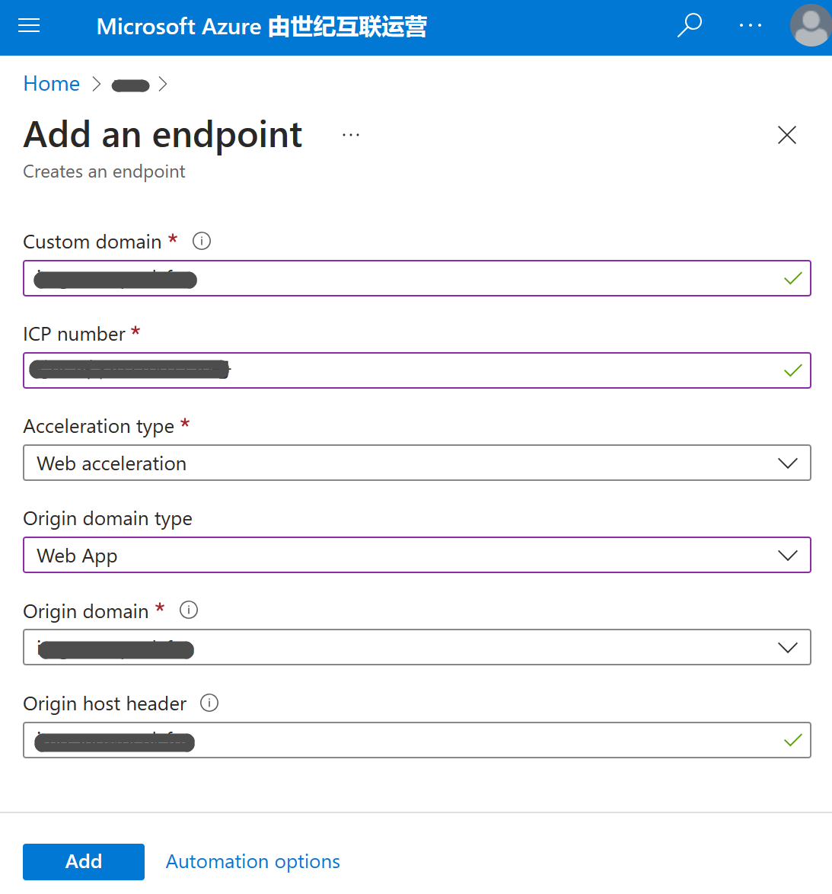

与海外 Azure 不同之处，在创建 CDN Profile 后，需要点击主窗格的 Manage 按钮去继续配置自定义域名的 SSL 证书。

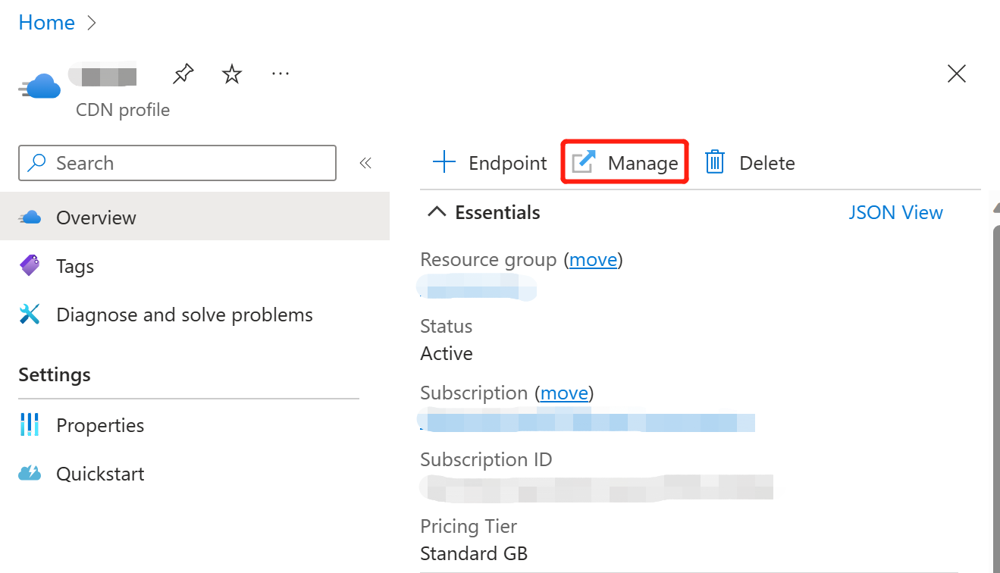

点击左侧导航菜单最下面的“配置”，在主窗格中密钥保管库 DNS 名称填写前面记录的 Vault URI，Azure Active Directory 客户端 ID 填写前面记录的 Application (client) ID，Azure Active Directory 密码填写前面记录的 Secret value，然后点击 Save 按钮。


通过上述配置，CDN 服务就可以从 Key Vault 里获取证书了。然后点击左侧导航菜单“安全管理”下点击“证书管理”，点击 “+添加一张 SSL 证书”按钮。按提示填写名称。
在证书源中选择“使用已有证书”。
在证书的下拉菜单中选择 CDN 域名需要Key Vault中保存的证书。
绑定域名的下拉菜单中选择“全部”。最后点击下面的“创建”按钮。

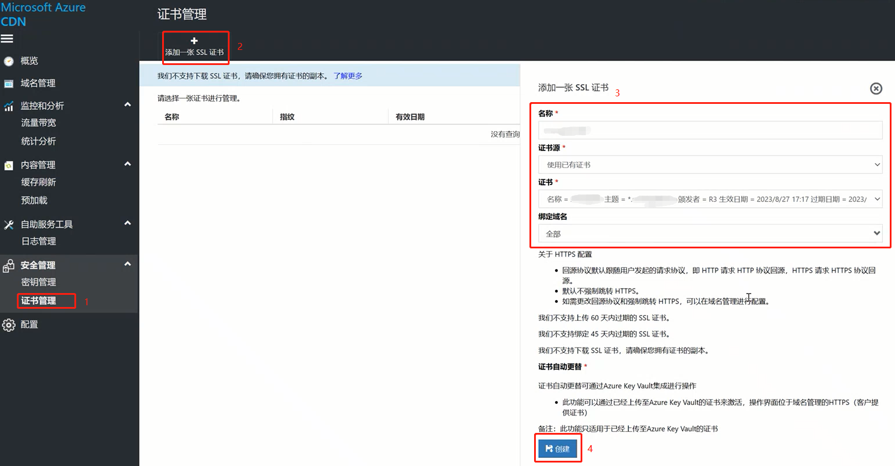

这里，再点击左侧导航菜单中的“域名管理”，可以看到自定义域名的“是否启用 HTTPS”为“是”，表示 SSL 证书已配置成功。

## 证书到期时手工更新
我现在是自己手工创建的免费证书，有效期只有90天，证书临近到期时需要在 CDN 管理中把证书手工更新。

手工更新证书:
1. Azure Key Vault 中在 Certifates 添加一个新的证书有效期足够的新证书。
2. 在 Azure CDN 管理控制台的证书管理中“添加一张SSL证书”，选择前面刚刚添加的新证书。
3. 到“域名管理”中，找到“HTTPS（客户提供证书）”选项卡，点击 “绑定证书”旁边的笔形图标。

在下面的“名称”中选择刚刚在证书管理中添加的新证书，确认“有效日期”已经更换成新的以后，点击最底下的“保存”按钮即可。

最后可以再回到证书管理，把之前即将过期的证书删除掉。


## CDN 绑定域名证书的自动轮换
https://learn.microsoft.com/zh-cn/azure/key-vault/certificates/tutorial-rotate-certificates#update-certificate-lifecycle-attributes


从官方文档确认，只有“通过与 Key Vault 合作的 CA 创建的证书”才能配置存储证书的生命周期从而支持CDN自动更新证书周期。
我现在是自己手工创建的免费证书，所以还不能启用这个功能。

# 多 CDN 回单一源站
Azure 中国的 CDN 在创建 Endpoint 时只能从已有的 App Service 中选取，但是创建后就可以自行修改成任意中国网络可达的源站了，这样我们整体架构可以进一步简化成 App Service 和 Blob 存储只配置一套，在海外和中国配置2个 CDN 即可。这里以 App Service 和 Blob 存储部署在海外为例，只需要再修改 Azure 中国的 CDN 配置。由于域名都配置在 CDN 上，所以所有 App Service 都不用再定制域名了，这样更简单。

先到 Azure 海外控制台找到 App Service 的默认域名，找到 App Service 的 Overview 页，记录下默认域名。

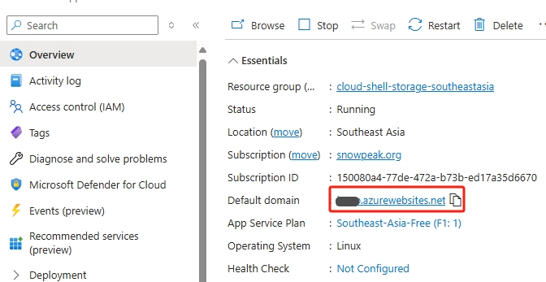

然后到 Azure 中国的 CDN 控制台，在 **域名管理** 找到我们已经创建的自定义域名，点击它进入编辑模式，在**属性**选项页，把**源站域名**和 **HOST头** 都填写成刚才记下的海外 App Service 的域名。点击保存，CDN操作需要一些时间完成，请耐心等待。

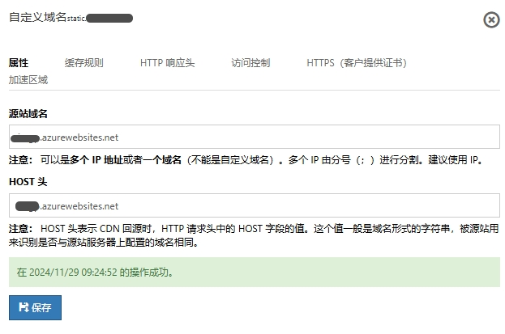

# TODO
1. 把 AAD 和Key Vault 画进架构图
2. 更多图片处理功能
3. 文件不存在的检测
4. 图片路径和图片处理参数都放到REQUEST_URI上。

## 本地测试环境
```shell
C:\Service\php>php-cgi.exe -b 127.0.0.1:9000 -c php.ini
C:\Service\nginx-1.27.3>nginx -s reload
```
