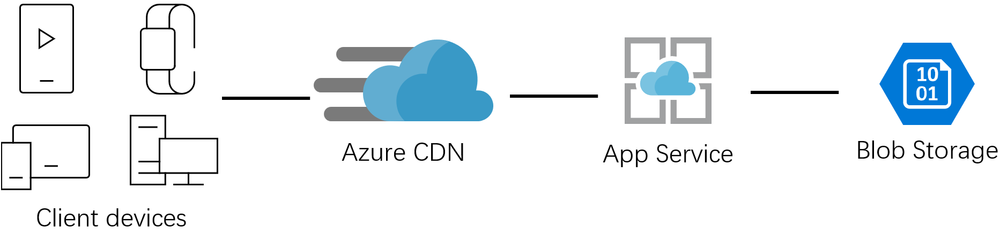
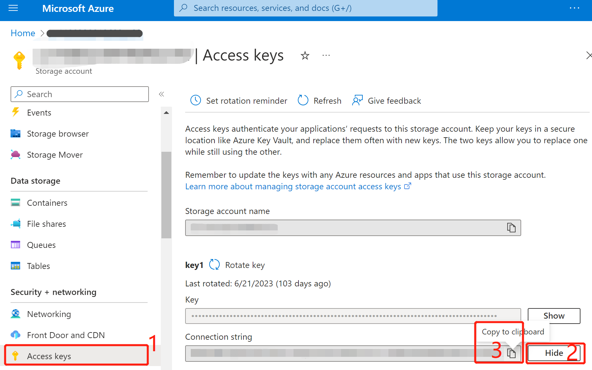
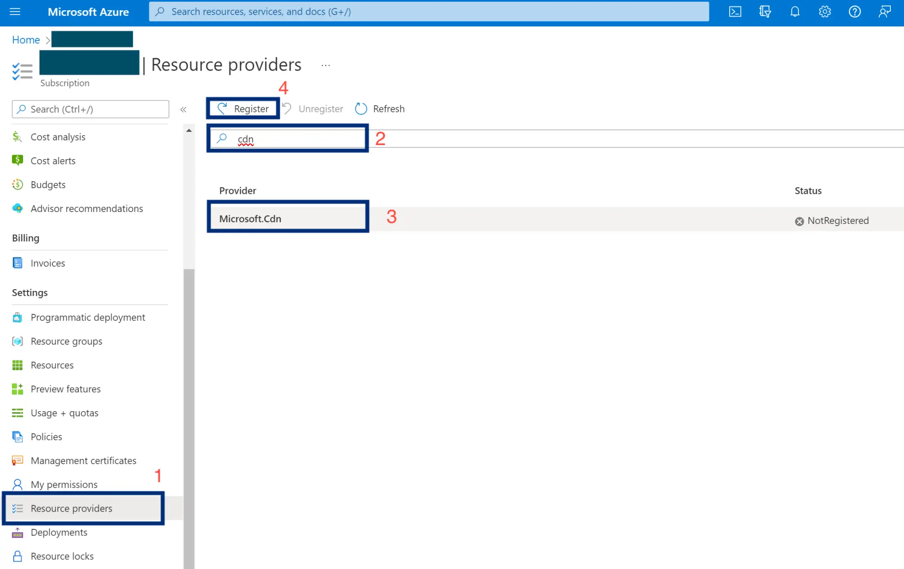
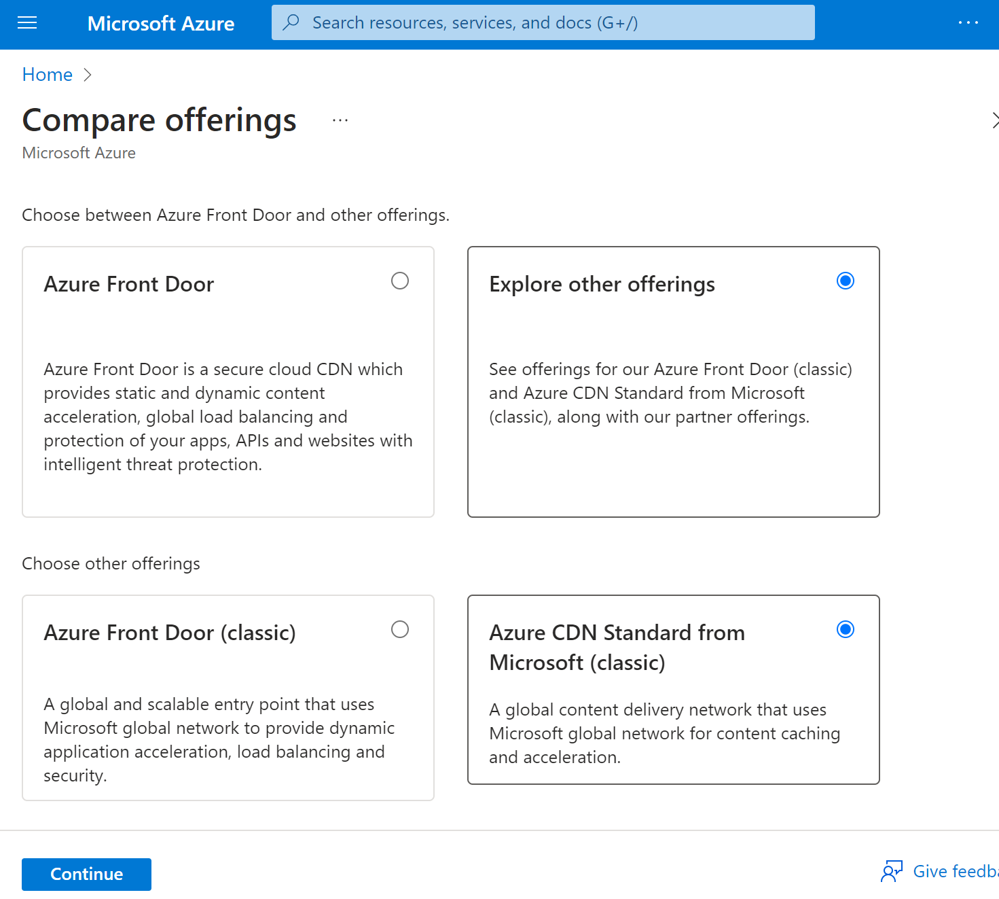
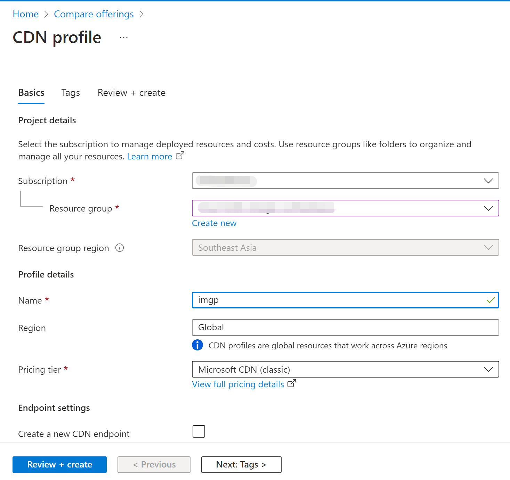
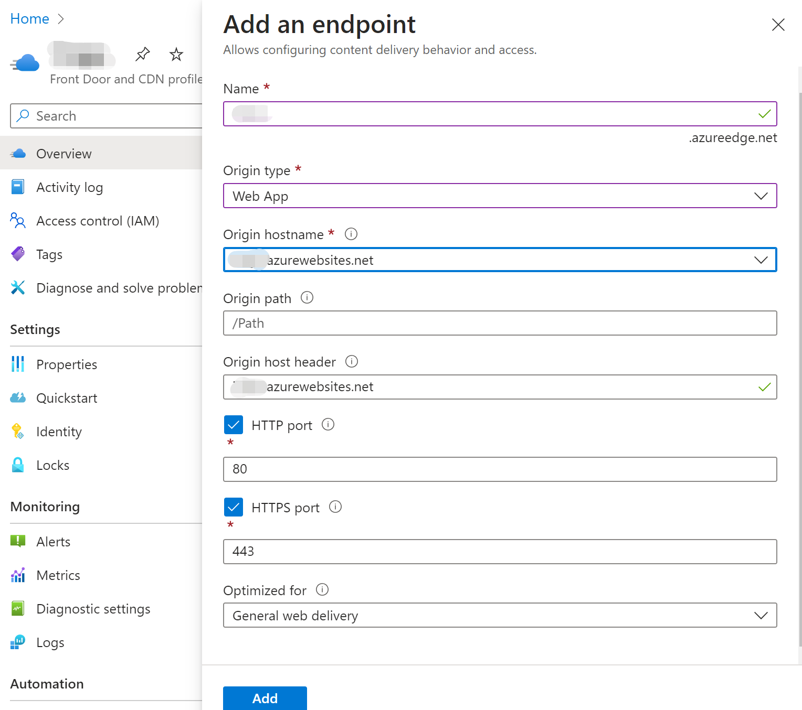
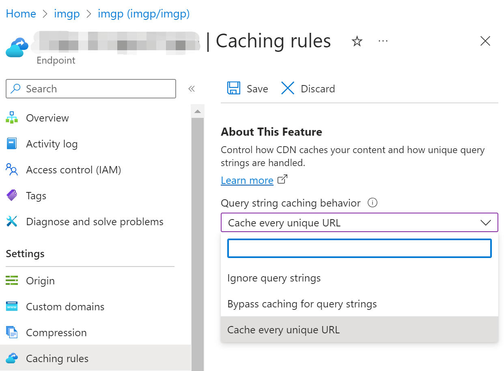

# 响应式图片处理

在开发网络应用时，我们经常会把原始图片保存起来，然后生成各种尺寸的缩略图，以及对图片进行翻转、裁剪和旋转等简单的处理。这种使用场景非常常见，以至于主流的云平台都提供了 PaaS 服务，其基本原理是基于 CDN 服务增加图片处理的逻辑，通过不同参数配合实现不同的图片处理功能。比如 Azure 中国区域的 CDN 就提供了这样的功能——[Azure CDN 图片处理](https://docs.azure.cn/zh-cn/cdn/cdn-image-processing)。

遗憾的是 Azure 海外区域还没有这个托管服务，不过结合已有的托管服务，实现一套这样的图片处理方案非常方便，尤其是使用 [Azure App Service](https://azure.microsoft.com/products/app-service/) 作为核心的计算服务，不仅[支持各种主流开发语言](https://learn.microsoft.com/en-us/azure/app-service/overview#built-in-languages-and-frameworks)，还内置了常见的扩展，开发图片处理的小应用就更加轻松了。

此方案整体架构图非常简洁。



# 准备一个 Blob 存储容器

上传的原始图片保存在 Azure Blob 存储中，参考[官方文档创建一个 Blob 存储容器](https://learn.microsoft.com/azure/storage/blobs/storage-quickstart-blobs-portal#create-a-container)，这里不再赘述。把创建好的Blob 存储容器名称记录下来，保存为一个环境变量 `AZURE_BLOB_CONTAINER`。

然后向这个存储容器中[上传几个图片文件](https://learn.microsoft.com/azure/storage/blobs/storage-quickstart-blobs-portal#upload-a-block-blob)，比如我上传了一个名为 Microsoft.png 的图片文件，供后续开发演示用。

把 Blob 存储容器的连接字符串记录下来，在存储账户的 Security + networking 下找到 Access keys，主窗格里的 key1 下面的 Connection string 点击 Show 按钮，再点击复制图标，把连接字符串复制到剪贴板，然后保存为一个环境变量 `AZURE_BLOB_CONNECTION`。后续供图片处理的应用使用。




# 本地开发
此应用开始时使用的是 PHP 8.2.1，需要启用 GD 扩展用于图片处理。使用 PHP Composer 安装 microsoft/azure-storage-blob。

把当前源码库 clone 到本地后，
```shell
cd image-process
php -S localhost:8000
```
即可运行本地测试站点。
在浏览器中打开 `http://localhost:8000/?filename=Microsoft.png&width=100&height=100` 即可看到图片处理的效果。

# App Service 部署

参考官方文档创建一个 App Service 实例，海外 Azure 支持免费档，足够我们测试和演示使用了。创建好的 App Service 实例所在资源组和名称记录下来，启用一个本地 Shell 保存为2个常量方便后续使用命令行部署。 

把前面保存的Blob存储容器的连接字符串和名称设置成 App Service的应用设置项目，可参考[官方文档](https://docs.microsoft.com/azure/app-service/configure-common#configure-app-settings)。

最后把代码打包部署上去即可。

```
RESOURCE_GROUP=my_resource_group
WEBAPP_NAME=my_app_service_name

az webapp config appsettings set -g $RESOURCE_GROUP -n $WEBAPP_NAME --settings AZURE_BLOB_CONNECTION="my_blob_connection"

az webapp config appsettings set -g $RESOURCE_GROUP -n $WEBAPP_NAME --settings AZURE_BLOB_CONTAINER="my_blob_container"

zip -r deploy.zip .
az webapp deploy -g $RESOURCE_GROUP -n $WEBAPP_NAME --src-path deploy.zip --type zip
```
App Servie PHP 8.2 版本直接支持 GD 库，无需安装。

到此，我们已经完成了一个简单的图片处理应用的开发和部署，可以在浏览器中访问 `https://my_app_service_name.azurewebsites.net/index.php?filename=Microsoft.png&width=100&height=100` 查看效果。更多图片处理的效果及参数，请参见[源码](index.php)。

接下来就是配置 CDN 服务，让图片处理应用能够通过 CDN 服务提供的功能，实现图片处理的加速。

# 配置 CDN 服务
先确认 CDN 服务已经注册为 resource provider。先到订阅的 Settings 找到 Resource provider，然后搜索 CDN，如果没有找到，点击 Register 按钮注册。



创建CDN实例，在 Offering 页点 Explore other offerings，再点 Azure CDN Standard from Microsoft (classic) 。

再按提示选择订阅、资源组，填写 CDN profile名称等即可。



CDN profile 创建好后，添加一个 Endpoint。在 CDN Profile 的 overview 页，右边主窗格点 +Endpoint 按钮，按提示填写 Endpoint 名称如`my_cdn_endpoint`、源站类型选择 `Web App`。

Origin hostname 从下拉菜单中选择前面部署好的 App Service 实例，比如 `my_app_service_name.azurewebsites.net`。其它的保持默认，点击最底下的 Add 按钮。



现在我们的图片处理都是通过参数来控制的，所以需要在 CDN Endpoint 的配置里把每个查询字符串的参数分别缓存。在 CDN Endpoint 的左侧导航菜单找到 Setting 下的 Caching Rules，右边主窗格点 Query string caching behavior菜单选择 Cache every unique URL，点击最上面的 Save 按钮。



到此，CDN 服务已经配置好了，可以在浏览器中访问 `https://my_cdn_endpoint.azureedge.net/index.php?filename=Microsoft.png&width=100&height=100` 查看效果。

## 添加自定义域名

## HTTPS 证书管理
必须通过 Azure Key Vault 管理，先要在 Azure AD 里注册一个应用，记下AAD应用的 Application (client) ID。创建一个应用的 Secrect，记下其 Secrect Value。

创建 Key Vault，在 Access Policy 里给 AAD 应用赋权，
Key Permissions
Secret Permissions
Certificate Permissions
都要选中。

回到 CDN 控制台，填写
密钥保管库 DNS 名称 => Key Vault Overview 页的 Vault URI
Azure Active Directory 客户端 ID => AAD应用的 Application (client) ID
Azure Active Directory 密码 => AAD应用的 Secrect Value

证书管理里
选择现有证书

更多图片处理功能

文件不存在的检测
图片路径放到REQUEST_URI上。
