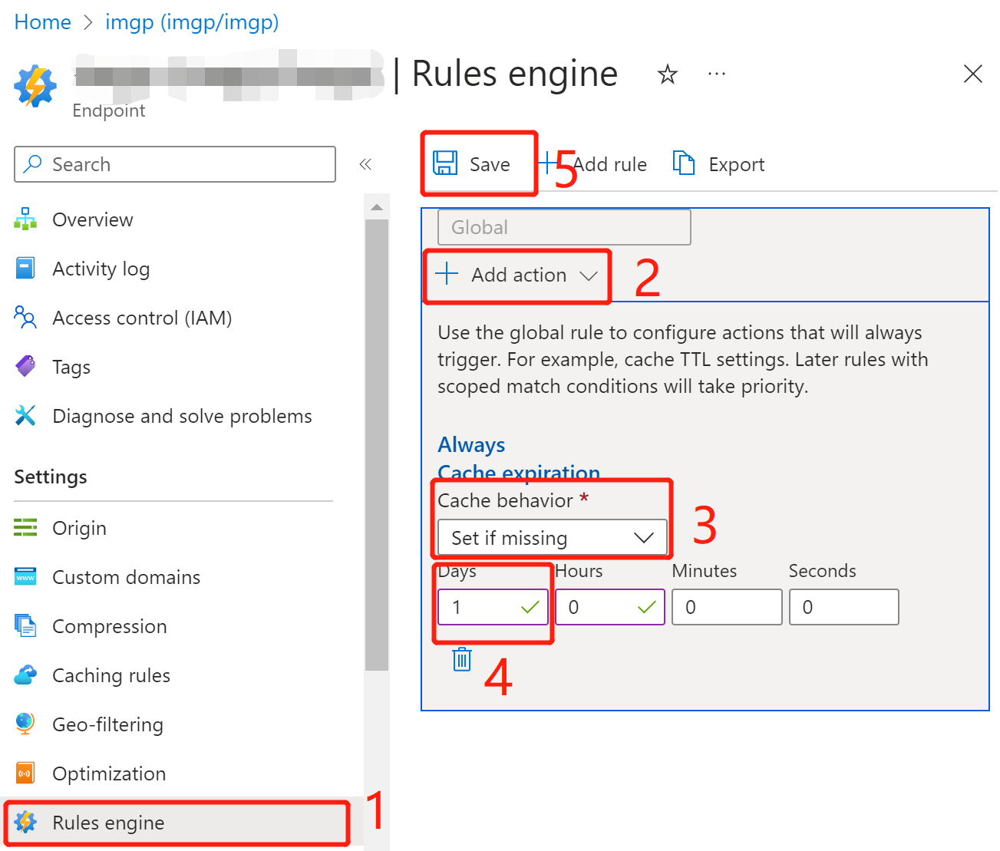
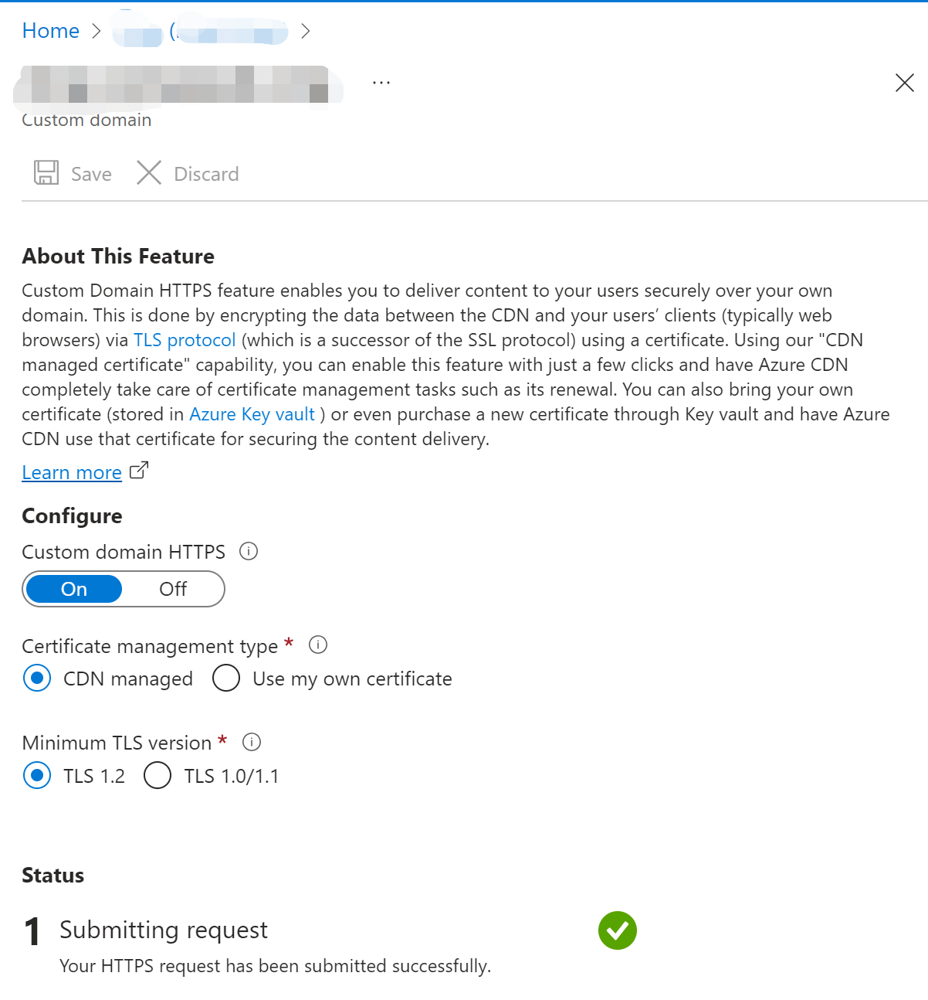
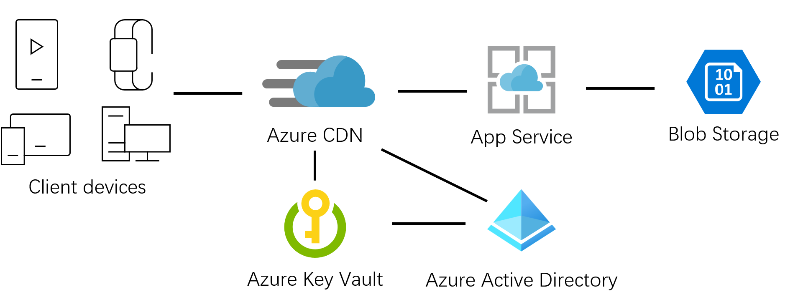
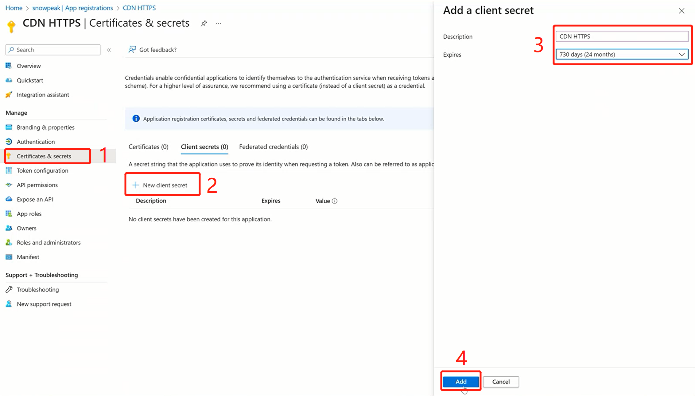
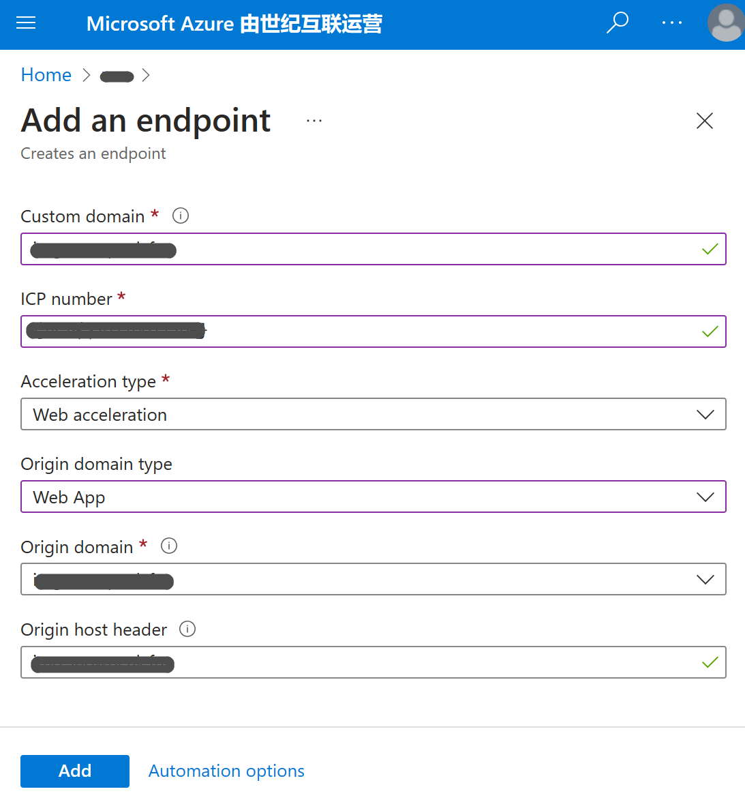
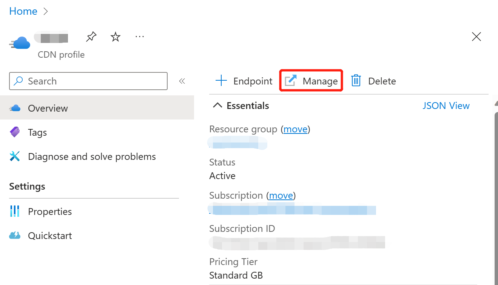
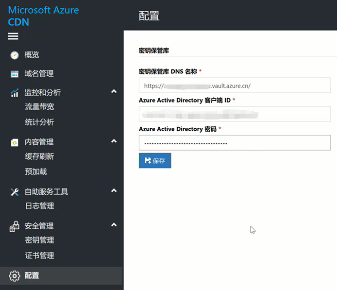

🌏 English | [中文](README.cn.md)

# Responsive Image Processing

When developing web applications, we often save the original images and then generate various sizes of thumbnails, as well as perform simple operations such as flipping, cropping, and rotating on the images. This use case is very common, so much so that mainstream cloud platforms provide PaaS services that add image processing logic based on CDN services, achieving different image processing functions through different parameters. For example, the CDN service in Azure China region provides such a feature - [Azure CDN Image Processing](https://docs.azure.cn/zh-cn/cdn/cdn-image-processing).

Unfortunately, Azure overseas regions do not yet have this managed service, but it is very convenient to implement such an image processing solution by combining existing managed services, especially using [Azure App Service](https://azure.microsoft.com/products/app-service/) as the core computing service, which not only [supports various mainstream development languages](https://learn.microsoft.com/en-us/azure/app-service/overview#built-in-languages-and-frameworks), but also comes with common extensions, making it even easier to develop small image processing applications.

The overall architecture of this solution is very simple.


# Prepare a Blob Storage Container

The uploaded original images are stored in Azure Blob Storage. Refer to the [official documentation to create a Blob Storage container](https://learn.microsoft.com/azure/storage/blobs/storage-quickstart-blobs-portal#create-a-container), which will not be repeated here. Record the name of the created Blob Storage container and save it as an environment variable `AZURE_BLOB_CONTAINER`.

Then upload a few image files to this storage container, as described in [upload a block blob](https://learn.microsoft.com/azure/storage/blobs/storage-quickstart-blobs-portal#upload-a-block-blob), for example, I uploaded an image file named Microsoft.png for later development demonstration.

Record the connection string of the Blob Storage container. In the Security + networking of the storage account, find Access keys, click the Show button under key1 in the main pane, then click the copy icon to copy the connection string to the clipboard, and save it as an environment variable `AZURE_BLOB_CONNECTION` for use by the image processing application later.


# Local Development
This application initially uses PHP 8.2.1 and requires the GD extension for image processing. Use PHP Composer to install microsoft/azure-storage-blob.

After cloning the current source code repository to your local machine,
```sh
cd image-process
php -S localhost:8000
```
to run the local test site. Open `http://localhost:8000/?filename=Microsoft.png&width=100&height=100` in a browser to see the effect of image processing.

# App Service Deployment

Refer to the official documentation to create an App Service instance. Azure supports a free tier for testing and demonstration purposes. Record the resource group and name of the created App Service instance and save them as two constants in a local shell for later use in command-line deployment.

Set the connection string and name of the saved Blob storage container as App Service application settings. Refer to the [official documentation](https://docs.microsoft.com/azure/app-service/configure-common#configure-app-settings) for guidance.

Finally, package and deploy the code.

```
RESOURCE_GROUP=my_resource_group
WEBAPP_NAME=my_app_service_name

az webapp config appsettings set -g $RESOURCE_GROUP -n $WEBAPP_NAME --settings AZURE_BLOB_CONNECTION="my_blob_connection"

az webapp config appsettings set -g $RESOURCE_GROUP -n $WEBAPP_NAME --settings AZURE_BLOB_CONTAINER="my_blob_container"

zip -r deploy.zip .
az webapp deploy -g $RESOURCE_GROUP -n $WEBAPP_NAME --src-path deploy.zip --type zip
```
App Service PHP 8.2 supports GD library directly, so there is no need to install it.

At this point, we have completed the development and deployment of a simple image processing application. You can view the result by accessing `https://my_app_service_name.azurewebsites.net/index.php?filename=Microsoft.png&width=100&height=100` in a browser. For more image processing effects and parameters, please refer to the [source code](index.php).

Next, we will configure a CDN service to accelerate image processing using the features provided by the CDN service.

# Configure CDN Service

First, confirm that the CDN service has been registered as a resource provider. Go to Settings in your subscription and find Resource provider. Then search for CDN. If you cannot find it, click the Register button to register it.


Create a CDN instance. On the Offering page, click Explore other offerings, and then click Azure CDN Standard from Microsoft (classic).


Follow the prompts to select the subscription, resource group, and CDN profile name, and so on.


After creating the CDN profile, add an Endpoint. On the overview page of the CDN profile, click the +Endpoint button on the right-hand pane, and follow the prompts to fill in the Endpoint name, such as `my_cdn_endpoint`, and select the source type as `Web App`.

Select the App Service instance that was deployed earlier, such as `my_app_service_name.azurewebsites.net`, from the drop-down menu for Origin hostname. Keep the other settings as default and click the Add button at the bottom.


Now that our image processing is controlled by parameters, we need to cache each query string parameter separately in the CDN Endpoint configuration. In the left-hand navigation menu of the CDN Endpoint, go to Settings and then Caching Rules. On the right-hand pane, select Cache every unique URL from the Query string caching behavior menu, and click the Save button at the top.


Configure the Rules engine of the CDN. Here, we use a simple rule to cache images for one hour. Under Settings, click Rules Engine, and then click + Add action on the right-hand pane of Global. Select Cache Expiration from the drop-down menu.

Select Set if missing from the Cache behavior menu, enter 1 for Days, and then click the Save button at the top.



At this point, the CDN service has been configured. You can view the result by accessing `https://my_cdn_endpoint.azureedge.net/index.php?filename=Microsoft.png&width=100&height=100` in a browser.

## Adding Custom Domain

To add a custom domain, first add a CNAME record at the DNS service provider, pointing to the custom domain of the CDN endpoint. For example, I added a CNAME record in the Alibaba Cloud Domain Resolution Console, pointing to `my_cdn_endpoint.azureedge.net`.

Then go back to the Azure CDN Endpoint configuration, find Custom domains, click the +Custom domain button, fill in the custom domain as prompted, and click the Add button at the bottom.


The newly added custom domain has a Custom HTTPS status of disabled. Click on this record to enter the Custom domain HTTPS management page.
Click the On button;
Select CDN managed for Certificate management type;
Select TLS 1.2 for Minimum TLS version.
Click the Save button above. By default, Azure will host a certificate for the custom domain, which may take a few minutes. Please wait patiently for the status to change to completed one by one.



At this point, our image processing application can be accessed through a custom domain. For example, I accessed `https://my_cdn_domain/index.php?filename=Microsoft.png&width=100&height=100` in my browser to see the effect.

# CDN Configuration in Azure China Region
There are some differences in the CDN service between the Azure China region and the Azure overseas region, mainly in certificate management. The CDN service in the Azure China region does not support certificate management for custom domains and can only manage certificates through Azure Key Vault. Therefore, we need to create a certificate in Azure Key Vault first, and then select the existing certificate in the CDN Endpoint configuration. The configuration for Blob Storage and App Service remains unchanged. The overall architecture diagram is a bit more complicated.



## Register an Application in Microsoft Entra ID

In the left navigation link of Microsoft Entra ID, click App registrations under Manage, and then click the New registration button. Fill in the application name, such as "CDN HTTPS", as prompted.
Select Accounts in this organizational directory only for Supported account types.
Click the Register button.


On the Overview page of the registered application, record the Application (client) ID.

Then click Certificates & secrets in the left navigation link, click the New client secret button, fill in the Secret description as prompted, select 730 days for Expires, and click the Add button.



After successfully adding, immediately click the copy icon at its Value to copy the Secret value to the clipboard. Note that this Secret value will only be displayed once, so be sure to copy and save it immediately.


## Create a certificate in Azure Key Vault
Refer to the official documentation [Create a Key Vault](https://docs.azure.cn/en-us/key-vault/general/quick-create-portal), and then [Upload a certificate for a CDN domain](https://docs.microsoft.com/en-us/azure/key-vault/certificates/quick-create-portal#create-a-certificate).

## Grant Entra application access in Key Vault

Click Access Policies on the left navigation link of Key Vault, click the + Create button, select Key Permissions, Secret Permissions, and Certificate Permissions on the Create an access policy page, and then click the Next button.


On the 2 Principal page, click the Select principal button, then enter the application name in the search box, such as "CDN HTTPS", click the application name in the search results, and then click the Select button. Then click the Next button.


The Application page does not need to be modified, click the Review + create button directly, and then click the Create button.

Back to the Overview page of Key Vault, record the Vault URI.

## Configure CDN Profile
The operation of creating a CDN Profile is the same as that of overseas Azure. You also need to add a CNAME record to your DNS resolution first, and point the custom domain name to the custom domain name of the CDN Endpoint. The operation of adding an Endpoint is different. Click the + Endpoint button, fill in Custom domain, ICP number, and Origin as prompted.

Select Web acceleration for Acceleration type, select Web App for Origin domain type, and select the App Service that has been deployed from the drop-down menu of Origin domain. Click the App button.



Unlike overseas Azure, after creating a CDN Profile, you need to click the Manage button in the main pane to continue configuring the SSL certificate for the custom domain name.



Click the "Configuration" at the bottom of the left navigation menu, fill in the Vault URI recorded earlier in the Key Vault DNS name of the key vault, fill in the Application (client) ID recorded earlier in the Azure Active Directory client ID, fill in the Secret value recorded earlier in the Azure Active Directory password, and then click the Save button.



With the above configuration, the CDN service can obtain the certificate from Key Vault. Then click "Certificate Management" under "Security Management" on the left navigation menu, click the "+ Add an SSL certificate" button. Fill in the name as prompted.
Select "Use existing certificate" in the certificate source.
In the drop-down menu of the certificate, select the certificate saved in Key Vault that CDN domain name needs.
Select "All" in the drop-down menu of the bound domain name. Finally, click the "Create" button below.


Here, click "Domain Management" in the left navigation menu again, you can see that the "Is HTTPS enabled" of the custom domain name is "Yes", indicating that the SSL certificate has been successfully configured.

## Manually Update Certificate When It Expires
I am currently using a manually created free certificate, which is only valid for 90 days. When the certificate is about to expire, it needs to be manually updated in the CDN management.

To manually update the certificate:
1. Add a new certificate with a sufficient validity period in Azure Key Vault under Certificates.
2. In the Azure CDN management console, go to certificate management and "Add an SSL certificate", selecting the newly added certificate.
3. Go to "Domain Management", find the "HTTPS (Customer Provided Certificate)" tab, and click the pencil icon next to "Bind Certificate".

In the "Name" field below, select the newly added certificate from certificate management, confirm that the "Valid Date" has been updated to the new one, and click the "Save" button at the bottom.

Finally, you can go back to certificate management and delete the previously expiring certificate.

## Automatic Rotation of CDN Bound Domain Certificates
https://learn.microsoft.com/zh-cn/azure/key-vault/certificates/tutorial-rotate-certificates#update-certificate-lifecycle-attributes

According to the official documentation, only "certificates created by a CA working with Key Vault" can be configured to store the certificate lifecycle to support automatic CDN certificate updates.
I am currently using a manually created free certificate, so this feature cannot be enabled yet.

# Multiple CDNs Returning to a Single Origin
When creating an Endpoint in Azure China CDN, you can only select from existing App Services, but after creation, you can modify it to any reachable origin in China. This way, our overall architecture can be further simplified by configuring only one set of App Service and Blob storage, and configuring 2 CDNs in overseas and China. Here, taking App Service and Blob storage deployed overseas as an example, you only need to modify the Azure China CDN configuration. Since the domain names are all configured on the CDN, all App Services do not need to customize domain names anymore, making it simpler.

First, go to the Azure overseas console to find the default domain name of the App Service, go to the Overview page of the App Service, and record the default domain name.


Then go to the Azure China CDN console, find the custom domain name we have created in **Domain Management**, click it to enter edit mode, and fill in the **Origin Domain Name** and **HOST Header** with the previously recorded overseas App Service domain name. Click save, CDN operations take some time to complete, please be patient.


# TODO
- [x] Add AAD and Key Vault to the architecture diagram
- [x] More image processing features
- [ ] Detection of file non-existence
- [ ] Put image paths and image processing parameters on REQUEST_URI.

# Unified Image Path and Image Processing Parameters in Filename, No Longer Using Query String

## Local Test Environment
```shell
C:\Service\php>php-cgi.exe -b 127.0.0.1:9000 -c php.ini
C:\Service\nginx-1.27.3>nginx -s reload
```